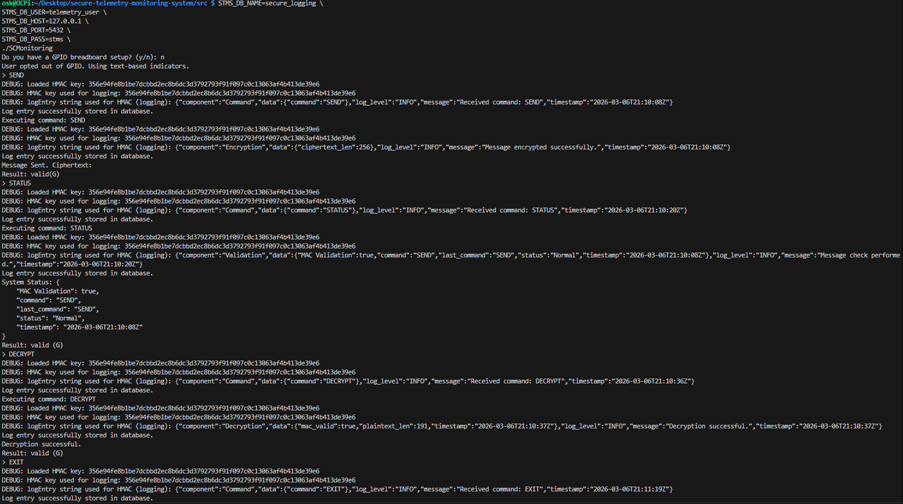
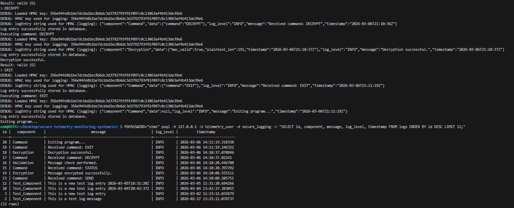

# Secure Communication and Monitoring System

Secure telemetry and command monitoring system built in **C++ on Raspberry Pi**, designed to demonstrate **secure communication pipelines, tamper detection, hardware monitoring, and database logging** for uncrewed vehicle systems.

The project simulates a **secure telemetry channel** where system messages are:

- encrypted with **AES-256-CBC**
- authenticated with **HMAC-SHA-256**
- validated for tampering
- logged to **PostgreSQL**
- displayed via **GPIO hardware indicators**

This system demonstrates core principles used in **embedded systems, secure communications, and monitoring infrastructure**.

---

# Project Motivation

This project was developed to further explore **secure system design, database logging, and embedded monitoring** in a practical environment.

Prior to this system, I implemented a **Secure Device Communication Protocol** in Python that simulated secure communication between a hardware device and an operating system. That project focused on cryptographic operations such as encryption, signing, key negotiation, and firmware validation to simulate real-world hardware security challenges.

Building on that foundation, this project extends the concept into a **C++-based monitoring system running on Raspberry Pi hardware**. The goal was to:

- continue developing **security-focused software systems**
- gain hands-on experience with **Raspberry Pi hardware integration**
- design and implement a **PostgreSQL-backed logging system**
- strengthen practical skills in **SQL and PostgreSQL database design**

Uncrewed vehicles and remote systems rely on secure telemetry channels to transmit commands and system data. If telemetry or command messages are modified during transmission, it can lead to **system compromise or loss of control**.

This project demonstrates how a secure communication pipeline can be built using:

- **Confidentiality** through AES-256 encryption
- **Integrity verification** through HMAC-SHA-256 validation
- **Real-time hardware feedback** using Raspberry Pi GPIO LEDs
- **Persistent security logging** using PostgreSQL

The goal is to simulate how **secure command channels and monitoring systems for remote or autonomous platforms** can be implemented in practice.

### Related Project

This project builds on a previous security-focused project:

**Secure Device Communication Protocol (Python)**  
https://github.com/YOUR_USERNAME/secure-device-communication

---

# Key Features

## Secure Telemetry Pipeline

The system generates telemetry data and passes it through a secure processing pipeline.

Telemetry includes:

- GPS coordinates
- speed
- battery level
- ISO-8601 timestamp

Messages are formatted as JSON and processed through the encryption system before validation.

---

## Command Interface

The system supports several operator commands:

| Command | Description |
|------|------|
| SEND | Generate telemetry and encrypt message |
| RESEND | Re-encrypt and resend the previous message |
| STATUS | Validate message integrity |
| DECRYPT | Fully decrypt and display telemetry |
| EXIT | Shutdown system |

---

## Hardware Status Indicators

The system uses **Raspberry Pi GPIO LEDs** for visual monitoring.

| GPIO Pin | LED | Meaning |
|--------|------|------|
| GPIO 19 | Green | Normal operation |
| GPIO 26 | Red | Error or tampering detected |

GPIO access uses the modern **libgpiod v2 interface** via `/dev/gpiochip0`.

The system automatically falls back to **text-only mode** if GPIO hardware is unavailable.

---

## PostgreSQL Security Logging

System events are recorded in a PostgreSQL database.

Logged events include:

- command execution
- encryption operations
- MAC validation results
- decryption operations
- system shutdown

Database configuration is handled via **environment variables** to avoid storing credentials in source code.

---

# Security Architecture

The system implements several core security mechanisms.

## AES-256-CBC Encryption

Telemetry messages are encrypted using **AES-256-CBC** via OpenSSL.

This ensures message confidentiality during transmission.

---

## HMAC-SHA-256 Message Authentication

Each message includes a **Message Authentication Code (MAC)**.

During validation the system verifies:
```
HMAC(message) == received MAC
```

If the values differ, the system flags **tampering**.

---

## Tamper Detection

If a MAC mismatch occurs:

- the system reports validation failure
- red LED alerts are triggered
- logs record the security event

---

# System Architecture

```text
                 +----------------------+
                 |  Telemetry Generator |
                 |    (telemetry.cpp)   |
                 +----------+-----------+
                            |
                            v
                 +----------------------+
                 |  Command Processor   |
                 |      (main.cpp)      |
                 +----------+-----------+
                            |
        +-------------------+-------------------+
        |                   |                   |
        v                   v                   v
+---------------+   +---------------+   +------------------+
| AES Encryption|   | HMAC Validation|   | Database Logging |
| encrypt_decrypt|  | encrypt_decrypt|   | log_db_operations|
+---------------+   +---------------+   +------------------+
        |
        v
+----------------------+
| Hardware Monitoring  |
|   led_control.cpp    |
|  GPIO19 / GPIO26     |
+----------------------+
```

# Repository Structure

```bash
secure-telemetry-monitoring-system/
│
├── src/                          # Core system source code
│   ├── main.cpp                  # Main command processor
│   ├── encrypt_decrypt.cpp       # AES encryption + HMAC validation
│   ├── telemetry.cpp             # Telemetry data generator
│   ├── led_control.cpp           # Raspberry Pi GPIO LED control
│   ├── utils.cpp                 # Shared utility functions
│   └── Makefile                  # Build configuration
│
├── database/                     # PostgreSQL database integration
│   ├── log_db_operations.cpp
│   ├── log_db_operations.h
│   ├── database_schema.sql
│   ├── database_utils.cpp
│   ├── database_config.json
│   └── test_log_db_operations.cpp
│
├── logs/                         # Logging subsystem + runtime logs
│   ├── logger.cpp
│   ├── logger.h
│   ├── test_logger.cpp
│   └── secure_monitoring.log
│
├── docs/                         # Project documentation
│   ├── logger_info.md
│   └── ReadMe
│
├── test/                         # Testing utilities
│   └── send_led_command.py
│
├── .vscode/                      # VSCode project configuration
│
└── README.md

## Secure Message Processing Flow

```text
Telemetry Data
     │
     ▼
JSON Message Creation
     │
     ▼
AES-256 Encryption
     │
     ▼
HMAC Generation
     │
     ▼
Secure Message Storage
     │
     ▼
Command Validation
     │
     ▼
Status Output + LED Feedback
```


# Build Instructions

- Navigate to the source directory:
```bash
cd src
```

- Clean previous builds:
```bash
 make clean
```

- Compile the system: make
```bash
 make 
```

The build links against the following libraries:

- OpenSSL
- libpqxx
- libpq
- libgpiod

Install dependencies on Debian-based systems:
```bash
sudo apt update
sudo apt install build-essential libssl-dev libpqxx-dev libgpiod-dev 
```
# Database Setup

Create the PostgreSQL role and database:
- CREATE ROLE telemetry_user LOGIN PASSWORD 'stms';
- CREATE DATABASE secure_logging OWNER telemetry_user;

Run the application with database configuration:

STMS_DB_NAME=secure_logging
STMS_DB_USER=telemetry_user
STMS_DB_HOST=127.0.0.1
STMS_DB_PORT=5432
STMS_DB_PASS=stms
./SCMonitoring


If database variables are not provided, the system **falls back to file logging**.

---

# Run Instructions

Launch the system:
- ./SCMonitoring
You will be prompted whether GPIO hardware is available.
- Use GPIO hardware? (y/n):

If unavailable, the system runs in **terminal monitoring mode**.

---

# Hardware Setup

Hardware configuration for Raspberry Pi:

| Component | Connection |
|------|------|
| Green LED | GPIO 19 |
| Red LED | GPIO 26 |
| Ground | shared ground rail |

LEDs are controlled through **transistor switching** for safe GPIO operation.

---

# Example Workflow

Example system session:



---

# Future Improvements

Potential extensions for the system include:

- secure network transmission of telemetry
- TLS communication channels
- automated integration testing
- log rotation and archival
- distributed monitoring dashboards
- message replay protection
- key management improvements

---

# Technologies Used

- C++
- Linux
- Raspberry Pi
- OpenSSL
- PostgreSQL
- libpqxx
- libgpiod
- JSON (nlohmann)


